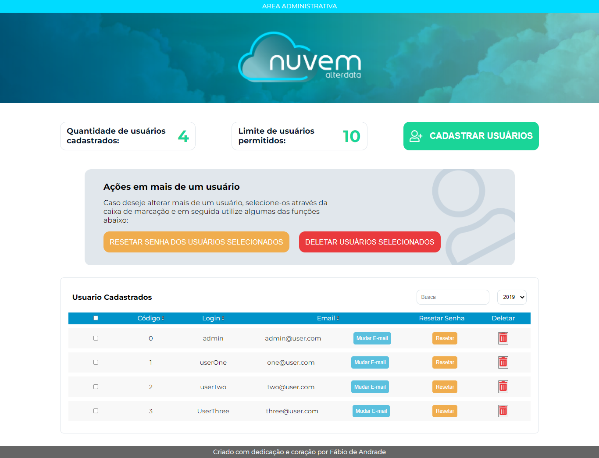

<div id="top"></div>

[![LinkedIn][linkedin-shield]][linkedin]


<!-- PROJECT LOGO -->
<br />
<div align="center">
  <a href="">
    
  </a>

  <h3 align="center">Teste Front End - Alterdata</h3>

  <p align="center">
    Teste front end desenvolvido para a Alterdata
    <br />
    <a href="https://github.com/fabiodeandrade/alterdatateste"><strong>Explore o código »</strong></a>
    <br />
    <br />
    <a href="https://alterdatateste.vercel.app/">Veja uma demonstração</a>
    ·
    <a href="https://github.com/fabiodeandrade/alterdatateste/issues">Reporte Problemas</a>
    ·
    <a href="https://github.com/fabiodeandrade/alterdatateste/issues">Solicite novidades</a>
  </p>
</div>


<!-- TABLE OF CONTENTS -->
<details>
  <summary>Conteúdo</summary>
  <ol>
    <li>
      <a href="#about-the-project">Sobre o projeto</a>
      <ul>
        <li><a href="#built-with">Construído com</a></li>
      </ul>
    </li>
    <li>
      <a href="#getting-started">Inicie</a>
      <ul>
        <li><a href="#prerequisites">Pré-requisitos</a></li>
        <li><a href="#installation">Instalação</a></li>
      </ul>
    </li>
    <li><a href="#usage">Usabilidade</a></li>
    <!-- <li><a href="#roadmap">Roadmap</a></li> -->
    <li><a href="#contributing">Contribuiçao</a></li>
    <li><a href="#license">Licença</a></li>
    <li><a href="#contact">Contato</a></li>
    
  </ol>
</details>


<!-- Sobre o projeto -->
## Sobre o Projeto

O projeto consiste em criar uma página de gerenciamento de usuário, dando a possibilidade do administrador, criar, editar e apagar os registros de usuarios

<p align="right">(<a href="#top">Volte para o topo</a>)</p>


### Construído com

Ele foi criado utilizando a versao 18 do React, assim como alguns componentes do Material Ui e também a utilização de rotas com o React Router Dom

* [React.js](https://reactjs.org/)
* [Material Ui](https://mui.com/pt/)
* [React Router Dom](https://reactrouter.com/)

<p align="right">(<a href="#top">Voltar para o topo</a>)</p>


<!-- Iniciando -->
## Iniciando - Ambiente de desenvolvedor

Para utilizar diretamento em sua máquina siga os passos abaixo

### Pré - requisito

Primeiro de tudo você precisa ter o Node instalado em sua máquina para rodar o gerenciador de pacotes npm:

### Instalação

1. Clone o repositório
   ```sh
   git clone https://github.com/fabiodeandrade/alterdatateste
   ```
2. Instale os pacotes de dependencias
   ```sh
   npm install
   ```
3. Rode em ambiente de desenvolvimento
   ```sh
   npm start
   ```

<p align="right">(<a href="#top">Voltar para o topo</a>)</p>


<!-- USAGE EXAMPLES -->
## Usabilidade

Através dos botões você consegue navegar entre os usuário assim como criar, editar e remover seus registros.


<p align="right">(<a href="#top">Voltar para o topo</a>)</p>

## Autor

<a href="https://github.com/fabiodeandrade">
 
 <br />
 <sub><b>Fábio de Andrade</b></sub></a>
 <br />

<p align="right">(<a href="#top">Voltar para o topo</a>)</p>

## Contato

[](mailto:fabiodeandradecontato@gmail.com?subject=[GitHub]%20Hey,%20Fabio%20Andrade)
[][linkedin]

[][whatsapp]
[-%23E4405F.svg?style=for-the-badge&logo=Instagram&logoColor=white" />][instagram] 

<p align="right">(<a href="#top">Voltar para o topo</a>)</p>


[linkedin-shield]: https://img.shields.io/badge/-LinkedIn-black.svg?style=for-the-badge&logo=linkedin&colorB=555
[product-screenshot]: images/screenshot.png

[whatsapp]: https://wa.me/5591984497281
[instagram]: https://www.instagram.com/faiboscript
[linkedin]: https://www.linkedin.com/in/fabiodeandrad/